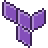
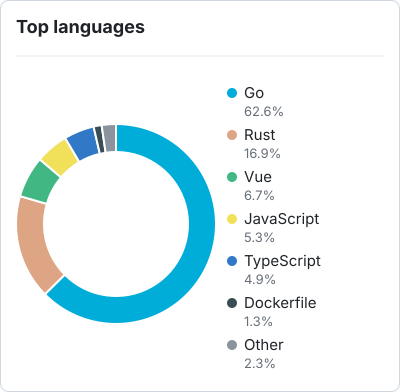
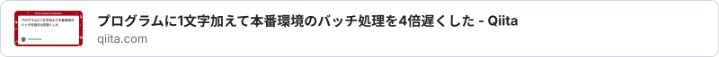
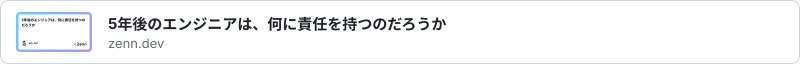

  

<h3 align="center">Links</h3>
<a href="https://my.prairie.cards/u/Parapo0onera"><picture><source media="(prefers-color-scheme: dark)" srcset="assets/icons/prairie-card-dark.png"></picture></a>&nbsp;<a href="https://x.com/parapo0onera"><picture><source media="(prefers-color-scheme: dark)" srcset="assets/icons/x-dark.png"></picture></a>&nbsp;<a href="https://linkedin.com/in/isshin-funada-041b66222"><picture><source media="(prefers-color-scheme: dark)" srcset="assets/icons/linkedin-dark.png"></picture></a>

 

<h3 align="center">Tech</h3>
&nbsp;&nbsp;&nbsp;&nbsp;&nbsp;&nbsp;

 

<!-- START:languages -->
<picture><source media="(prefers-color-scheme: dark)" srcset="assets/cards/top-languages-dark.svg"></picture>
<!-- END:languages -->
<!-- START:music -->
<picture><source media="(prefers-color-scheme: dark)" srcset="assets/cards/now-playing-dark.svg"></picture>
<!-- END:music -->

 

<h3 align="center">Recently read</h3>

<!-- START:reading -->
<a href="https://note.com/nice_deer931/n/n41161c225b14"><picture><source media="(prefers-color-scheme: dark)" srcset="assets/cards/recent-reading-1-dark.svg"></picture></a> 
<a href="https://zenn.dev/mire0726/articles/1f3f118662a0f5"><picture><source media="(prefers-color-scheme: dark)" srcset="assets/cards/recent-reading-2-dark.svg"></picture></a> 
<a href="https://zenn.dev/mizchi/articles/mutation-test-quality"><picture><source media="(prefers-color-scheme: dark)" srcset="assets/cards/recent-reading-3-dark.svg"></picture></a> 
<a href="https://qiita.com/kotowazaman/items/9ee7c475a475e7527b0e"><picture><source media="(prefers-color-scheme: dark)" srcset="assets/cards/recent-reading-4-dark.svg"></picture></a> 
<a href="https://zenn.dev/kesin11/articles/20261114_github_issue_artifact"><picture><source media="(prefers-color-scheme: dark)" srcset="assets/cards/recent-reading-5-dark.svg"></picture></a>
<!-- END:reading -->

Pixel icons: <a href="https://github.com/hackernoon/pixel-icon-library">HackerNoon Pixel Icon Library</a> (CC BY 4.0) ・ fonts: Noto Sans JP (OFL) ・ details in <a href="docs/credits.md">credits</a>

